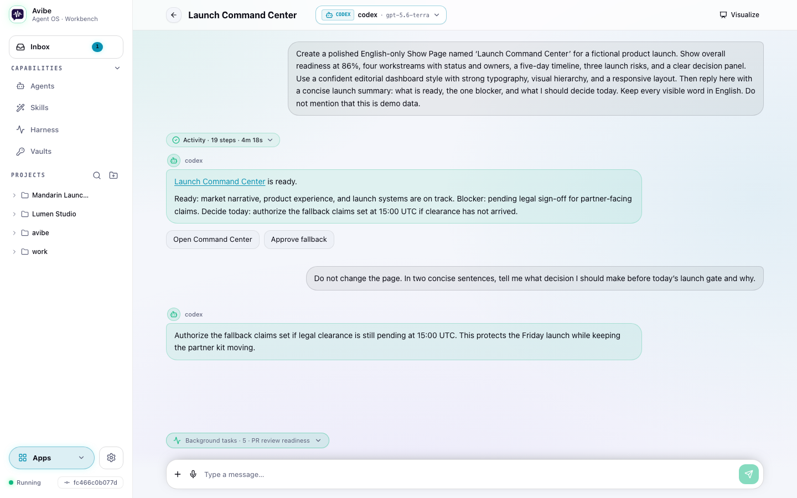
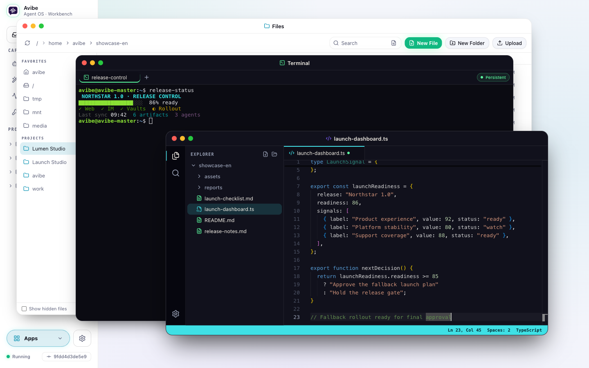
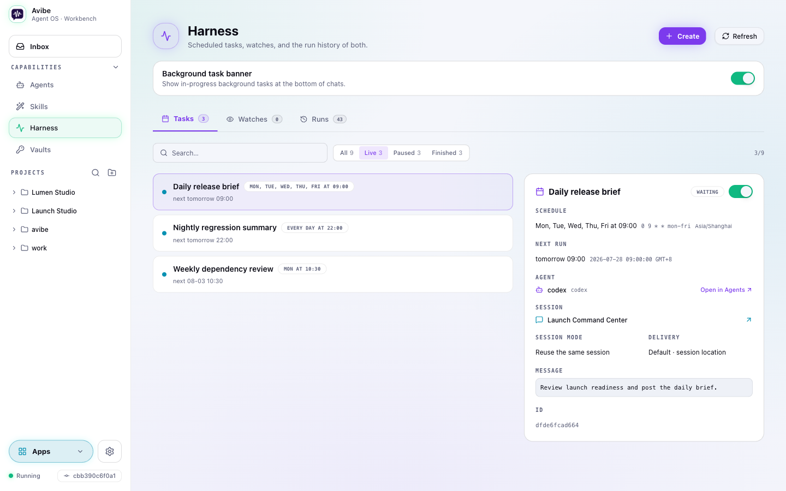
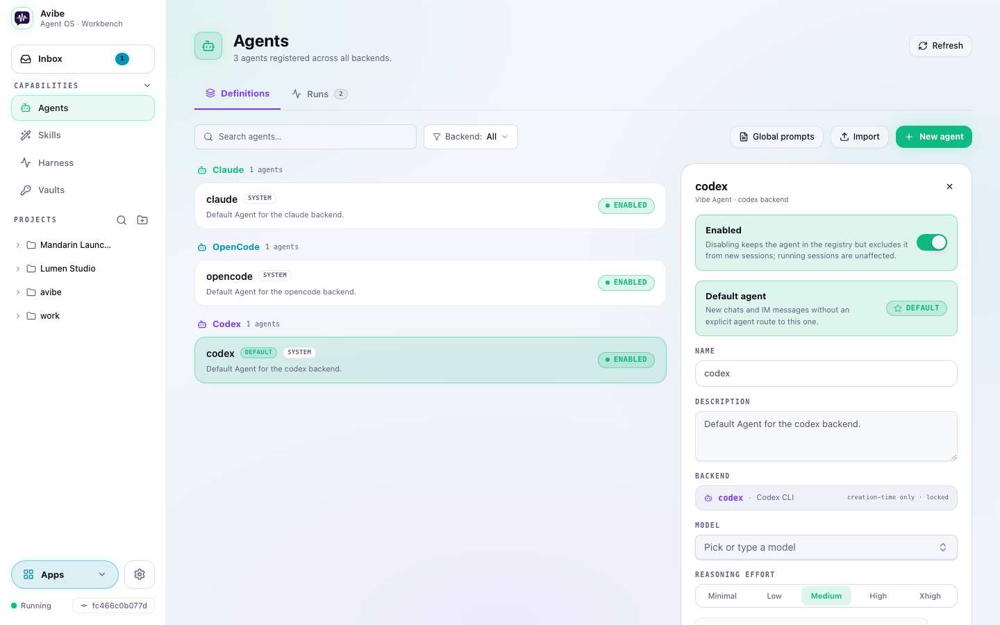
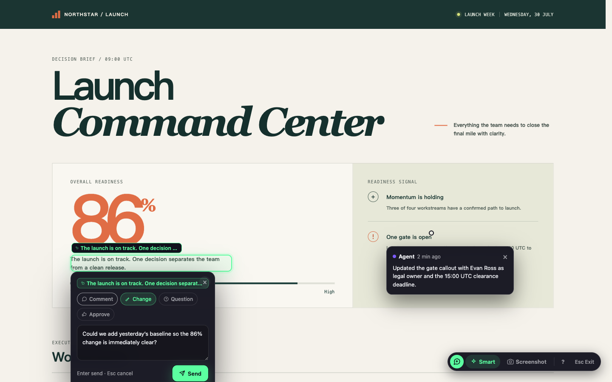
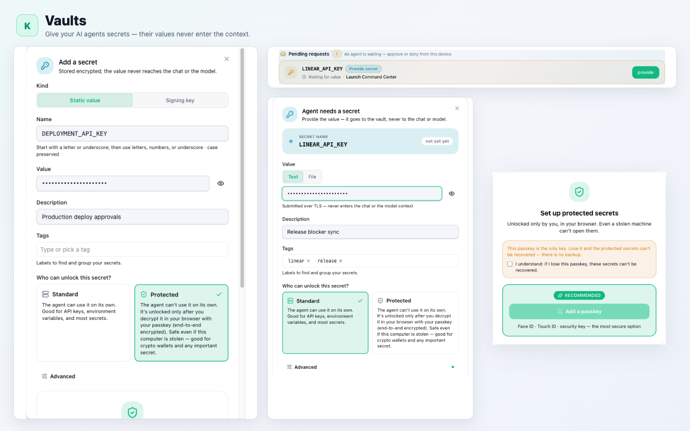
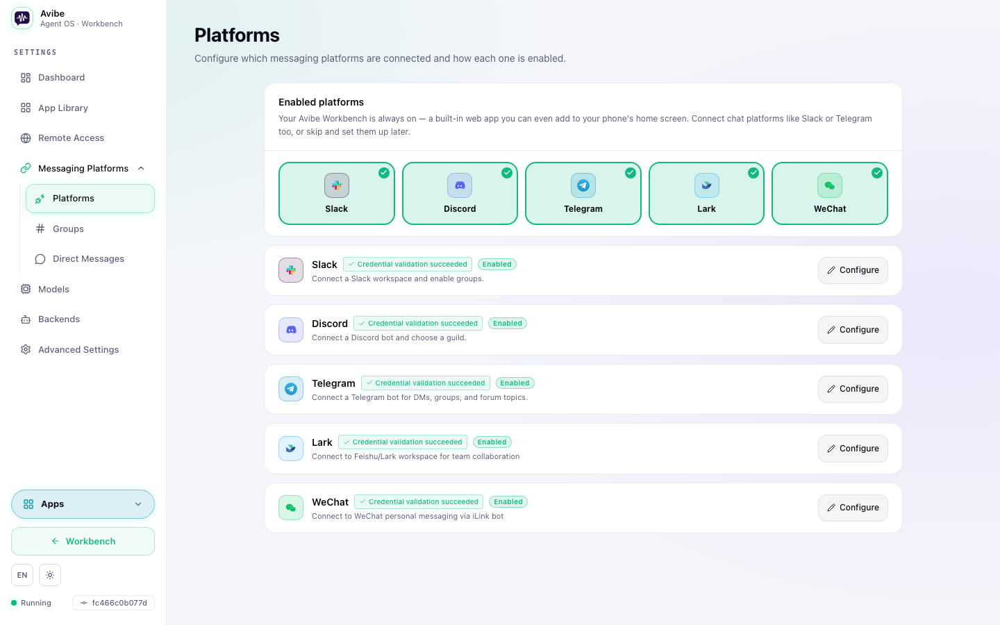
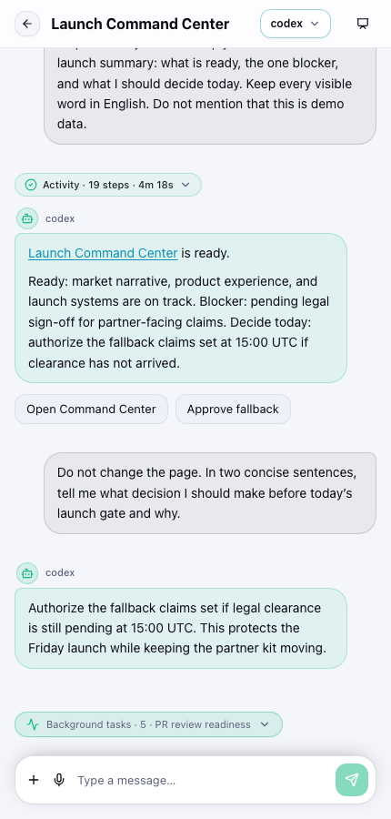

<div align="center">


# Avibe

### The local-first Agent OS — your AI partner lives on your own machine.

**Own the agent. Reach it from anywhere. Never get locked in.**

[](https://github.com/avibe-bot/avibe/stargazers)
[](https://www.python.org/)
[](LICENSE)

<a href="https://www.producthunt.com/products/vibe-remote?embed=true&utm_source=badge-featured&utm_medium=badge&utm_campaign=badge-vibe-remote" target="_blank" rel="noopener noreferrer"></a>

[Docs](https://docs.avibe.bot) · [English](README.md) · [中文](README_ZH.md)

**Drives**   

**Reach it from**      

</div>

<br/>



---

## Your AI agent is brilliant — and stuck

Claude Code, Codex, OpenCode are incredible. But:

- 🖥️ **Trapped on one machine.** Your agent lives in a terminal. Close the laptop and it stops.
- 📵 **Out of reach.** Away from your desk, you can't see what it's doing — let alone steer it.
- 🔒 **Locked in.** Every tool wants to be the whole stack: its app, its cloud, its subscription, your code uploaded to someone else's box.

## Avibe flips that

**One command turns your own machine into the home your AI partner lives in.** You drive the *official* Claude Code, Codex, and OpenCode — from a browser or any chat app — while your code and keys stay on your machine, and avibe.bot never sees your data.

```bash
curl -fsSL https://avibe.bot/install.sh | bash && vibe
```

The browser opens, you follow a short wizard, and your machine becomes an Agent OS you can reach from anywhere.

> Open source — read the [install script](https://github.com/avibe-bot/avibe/blob/master/install.sh) first if you like. The short URL is a 307 redirect to that file.

<details>
<summary><b>On Windows?</b></summary>

We recommend WSL on Windows for the best compatibility — see [Run Avibe with WSL from scratch](docs/WINDOWS_WSL.md). It covers where to install WSL, which terminal to use, where to run the install command, and how to open the Web UI.
</details>

> 💚 **Built with Avibe.** This project was developed end-to-end using Avibe itself — steering Claude Code, Codex, and OpenCode from the browser and from my phone, picking up seamlessly whether I was at my desk or not. The deeper in I got, the faster it went. — [@alex_metacraft](https://x.com/alex_metacraft)

---

## What you get

### 💬 A Workbench, not another chat box

Chat, inspect files, edit code, and run terminal commands in one windowed workspace. Built-in apps and the Show Pages your agent creates open side by side, so the browser feels like an Agent OS instead of a settings dashboard.



### 🧠 Its own timeline — the Agent Harness

Most AI tools only act when you type. Avibe gives your agent durable primitives — **run, schedule, watch, and inspect** — so it can start work, wait for the right moment, run in the background, and come back with results. Every task and watch has an owner, session, delivery target, and inspectable run history.



### 🤖 Bring the agents you already trust

Run the official Claude Code, Codex, and OpenCode CLIs behind one Agent registry. Choose models and reasoning per Agent, route projects to the right specialist, and keep reusable Skills shared across backends.



### 🎨 Show Pages — point, comment, and iterate

When a picture beats a paragraph, your agent hands you a live web page — a flowchart, dashboard, diff, report, or small app. Comment on an element or screenshot, and the agent can rework the page or answer exactly where you pointed.



### 🔐 Vaults — secret values stay out of Vault responses

Add a **Standard** secret once and approve Agent requests from the browser. Avibe's Vault responses never include the secret value; commands receiving it must still avoid printing it. The screenshot also previews **Protected**, passkey-gated custody, which remains pre-launch until the sandbox integrity gate is enforced.



### 🌐 Browser and messaging are equal surfaces

Use the Workbench when you want windows and rich interaction; use Slack, Discord, Telegram, WeChat, or Lark / Feishu when chat is the fastest route. They reach the same Agents and sessions.



### 📱 In your pocket



Your machine runs the work; you don't have to sit in front of it. Install the Workbench as a desktop or mobile app, use built-in voice-to-text, and get a push notification when a job needs you. Run `vibe remote` and the same local Workbench becomes reachable from any browser through a secure `avibe.bot` tunnel — no VPN or port forwarding.

You're on a plane, at a café, on a borrowed laptop. The agent pings that a job needs you. Open the link, steer it, walk away again.

- 🌍 **Your own `you-app.avibe.bot`** — 30-second sign-in, your slug for life
- 🔒 **Fail-closed at every join** — auth, routing, and host checks default to "deny"
- 📱 **Mobile-aware UI** — thumb-friendly, built for borrowed screens

**Your data plane stays on your machine**; `avibe.bot` only carries the control-plane handshake.

<br clear="all"/>

**Plus** — per-channel Agent routing · resumable sessions (thread = session) · interactive prompts · voice-to-text · file attachments · push and completion notifications.

---

## Why Avibe is different

| | |
|---|---|
| **Local-first, and yours** | Your AI partner, its execution, your keys, and your data stay on your machine. `avibe.bot` only issues identity and a secure tunnel — it never proxies your data. |
| **One substrate, every first-party agent** | Drive the *official* Claude Code, Codex, and OpenCode. Bring your own subscription or keys, switch per task, and never get locked into one vendor's silo. |
| **Browser and chat, both first-class** | Operate from the browser Workbench, or from Slack, Discord, Telegram, WeChat, and Lark / Feishu. Same agent, same sessions. |
| **No middleman** | No extra reasoning loop sits between you and your agent. Tokens go straight to the agent you chose. |

---

## How it works

```
┌──────────────┐            ┌──────────────┐            ┌──────────────┐
│     You       │  browser   │              │   stdio    │  Claude Code  │
│  (anywhere)   │   Slack    │    Avibe      │ ─────────▶ │  OpenCode     │
│               │  Discord   │ (your machine)│ ◀───────── │  Codex        │
│               │  Telegram  │              │            │               │
│               │  WeChat    │              │            │               │
│               │  Lark      │              │            │               │
└──────────────┘            └──────────────┘            └──────────────┘
```

1. **You type** — in the browser or a chat app: *"Add dark mode to the settings page."*
2. **Avibe routes** to your configured agent, in the right project.
3. **The agent** reads your local codebase, writes code, and streams back.
4. **You review** in the same surface, iterate in the thread, and resume later from anywhere.

**Your code stays on your machine.** Avibe runs locally and connects out via Slack Socket Mode, Discord Gateway, Telegram long-polling, WeChat polling, or Lark WebSocket — no public inbound ports for normal chat control. Prompts go only to the AI provider you choose.

---

## Avibe vs OpenClaw

| | Avibe | OpenClaw |
|---|---|---|
| **Setup** | One command + web wizard. Done in minutes. | Gateway + channels + JSON config. Expect an afternoon. |
| **Security** | Local-first. Socket Mode / WebSocket only. No public inbound ports, minimal attack surface. | Gateway exposes ports. More moving parts, more surface. |
| **Token cost** | No extra reasoning loop in between. Tokens go straight to your chosen agent. | Every message carries a long persona/orchestration context. Tokens burn on overhead before your task starts. |
| **Lock-in** | Drives the official agent CLIs; bring your own keys; switch per task. | Tied to its own assistant loop. |

OpenClaw is an always-on personal assistant — great for casual chat, expensive for real work. Avibe is a **local-first Agent OS** for the agents you already trust: the agent stays itself, your data stays local, and the colleague experience comes from putting the agent into the flow where your work already happens.

---

## FAQ

<details>
<summary><b>Does it run local models?</b></summary>

Local-first here means your **code, data, and execution** stay on your machine — not the model weights. Avibe drives the agent you configure (Claude Code, Codex, OpenCode); OpenCode can point at local or OpenAI-compatible endpoints if you want inference local too.
</details>

<details>
<summary><b>Where do my code and data go?</b></summary>

Your code, keys, and agent processes stay on your own machine. `avibe.bot` only issues identity and a secure tunnel — it never proxies or stores your data. Prompts go only to the AI provider you chose.
</details>

<details>
<summary><b>Do I have to pay for Avibe?</b></summary>

Avibe is open source (MIT) and free to run. You bring your own agent subscription or API keys and pay your provider directly — no markup, no second subscription.
</details>

<details>
<summary><b>Which agents and platforms are supported?</b></summary>

**Agents:** the official Claude Code, Codex, and OpenCode CLIs. **Surfaces:** a built-in browser Workbench plus Slack, Discord, Telegram, WeChat, and Lark / Feishu.
</details>

<details>
<summary><b>Is remote access secure?</b></summary>

`vibe remote` opens a Cloudflare tunnel; browser traffic reaches your machine only after sign-in. Auth, routing, and host checks are **fail-closed**, and there are no public inbound ports for normal chat control.
</details>

<details>
<summary><b>How is Avibe different from OpenClaw or Hermes?</b></summary>

OpenClaw and Hermes are *agents* — a gateway-style assistant and a self-improving agent. Avibe is a different layer: the **Agent OS**. It gives any agent a unified world model — agents, sessions, Show Pages, the Harness — so it can schedule itself, build its own loops, and reach you through a real interaction layer, then runs the official Claude Code, Codex, and OpenCode you bring (an Avibe-native agent is [on the roadmap](#roadmap)). See the [comparison table](#avibe-vs-openclaw) above for OpenClaw specifics.
</details>

---

## Talk to it like a colleague

Ask in plain language and the Harness composes the commands behind the scenes:

- *"Watch this PR and come back when there's actionable review feedback."*
- *"Run the deployment check every weekday morning and post the summary here."*
- *"Start a separate investigation session for this incident, but report the conclusion to this channel."*
- *"If CI fails, summarize the logs; if it passes, tell me whether the PR is mergeable."*

**Switch agents mid-conversation** — just prefix your message:

```
Plan: design a new caching layer for the API
```

**Route per project** — different work, different agent:

```
frontend   → OpenCode    (fast iteration)
backend    → Claude Code  (complex logic)
prototypes → Codex        (quick experiments)
```

---

## Meet Vibey

<div align="center">

</div>

Lives in your Workbench and your chat apps. Reads the room. Picks up where you left off. Asks the right question when it's unsure. Goes quiet when you're heads-down. Ships at 2am because that's when the vibe hits — then leaves a note about what it touched.

> Avibe is the home your agent lives in. Vibey is the colleague who lives there.

Forgets nothing. Holds opinions. Says thanks when you fix its bugs.

---

## Commands

```bash
vibe            # Start Avibe and open the Workbench
vibe status     # Check service and configuration status
vibe stop       # Stop the local service
vibe doctor     # Diagnose common setup issues; use "vibe doctor repair" for explicit safe fixes
vibe remote     # Reach your Workbench from any device via avibe.bot
vibe agent      # Run and manage Avibe agents
vibe task       # Schedule time-based work (cron / one-off)
vibe watch      # Wait on a condition, then act
vibe runs       # Inspect agent run history
vibe vault      # Manage secrets, requests, authenticated fetches, and signing
```

| In chat | What it does |
|---|---|
| Mention the bot | Start a task or ask a question |
| Reply in thread | Continue the same agent session |
| `/stop` | Stop the current session |

Full references: [Commands](docs/COMMANDS.md) · [CLI](docs/CLI.md)

---

## Prerequisites

You need at least one agent installed:

<details>
<summary><b>OpenCode</b> (recommended)</summary>

```bash
curl -fsSL https://opencode.ai/install | bash
```

Add to `~/.config/opencode/opencode.json` to skip permission prompts:

```json
{ "permission": "allow" }
```
</details>

<details>
<summary><b>Claude Code</b></summary>

```bash
npm install -g @anthropic-ai/claude-code
```
</details>

<details>
<summary><b>Codex</b></summary>

```bash
npm install -g @openai/codex
```
</details>

---

## Security

- **Local-first** — Avibe runs on your machine; your code and agent processes stay there.
- **No public inbound ports** — Socket Mode / WebSocket / long-polling only for chat control.
- **Your keys, your data** — stored under `~/.avibe/`, sent only to the AI provider you chose. Existing installs keep `~/.vibe_remote/` as a compatibility path.
- **Fail-closed remote access** — `avibe.bot` only brokers identity and the tunnel, never your data.

---

## Uninstall

```bash
vibe stop
uv tool uninstall avibe-os
uv tool uninstall vibe-remote   # legacy installs
rm -rf ~/.avibe ~/.vibe_remote
```

---

## Roadmap

What's coming next:

- **Deeper interaction-first workflows** — more direct manipulation, structured decisions, and in-place collaboration between chat, apps, and Show Pages.
- **Protected Vault custody** — finish the immutable sandbox integrity gate before enabling passkey-protected secrets for real users.
- **SaaS mode** — one-click hosted onboarding with a cloud relay, while execution still stays on your own machine.
- **An Avibe-native agent** — a first-party agent tuned for this runtime, alongside the official CLIs you bring.

Shipped recently: multi-window Apps, Show Page annotations, the Agent Harness, Standard Vaults, voice-to-text, and the Skills manager.

---

## Docs

- **[Official Docs](https://docs.avibe.bot)** — quickstart, concepts, platform & agent guides, troubleshooting
- **[What is Avibe](https://docs.avibe.bot/concepts/agent-os)** — the Agent OS model
- **[CLI Reference](docs/CLI.md)** · **[Commands](docs/COMMANDS.md)**
- **[Install via AI agent](docs/INSTALL_FOR_AI.md)** — hand this to Claude Code, Codex, or OpenCode for guided setup
- **[Slack](docs/SLACK_SETUP.md)** · **[Discord](docs/DISCORD_SETUP.md)** · **[Telegram](docs/TELEGRAM_SETUP.md)** setup guides

---

<div align="center">

**Own the agent. Reach it from anywhere.**

[Install Now](#avibe-flips-that) · [Docs](https://docs.avibe.bot) · [Report a bug](https://github.com/avibe-bot/avibe/issues) · [Follow @alex_metacraft](https://x.com/alex_metacraft)

</div>
