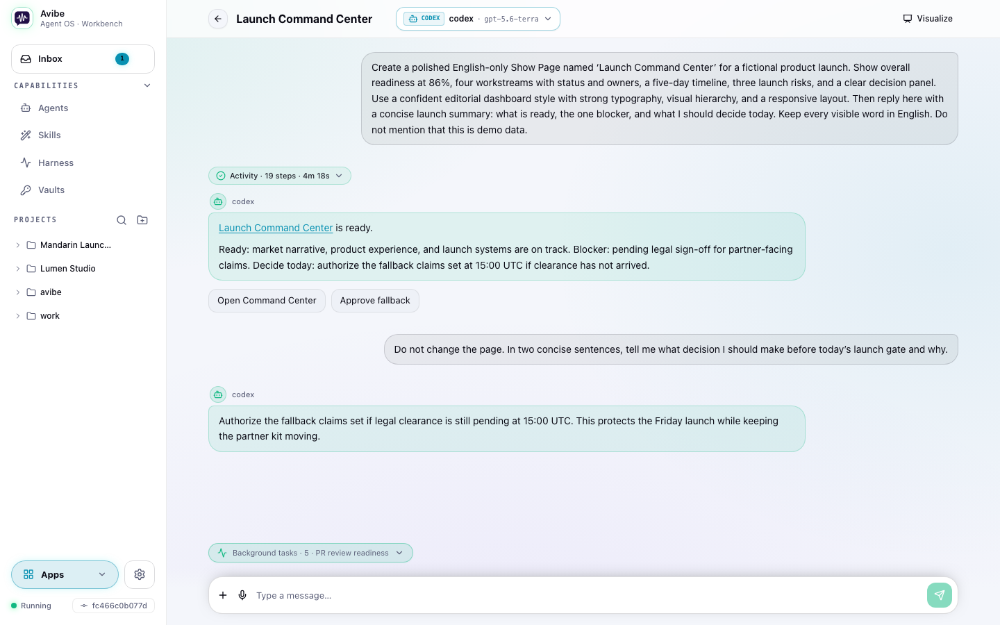
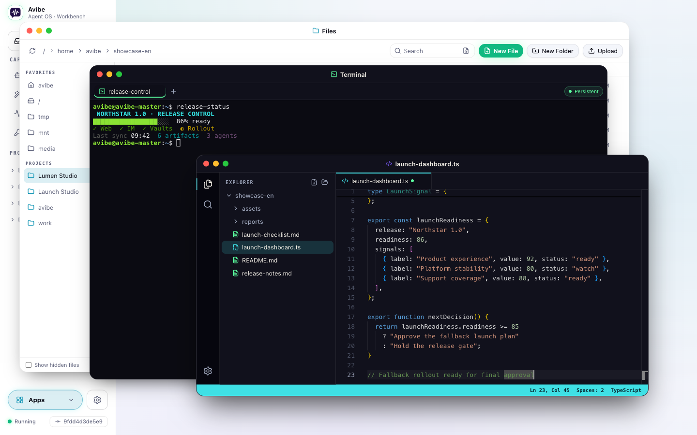
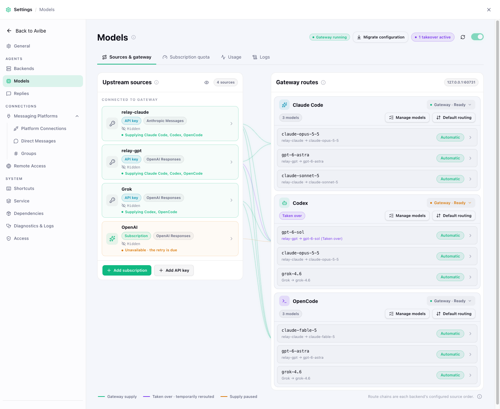
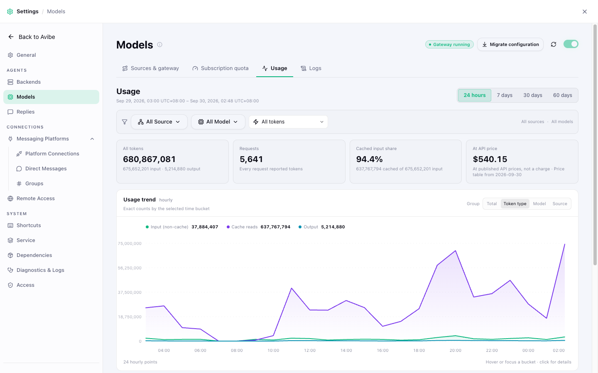
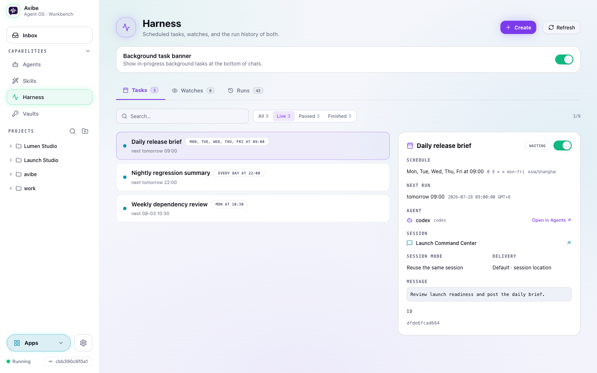
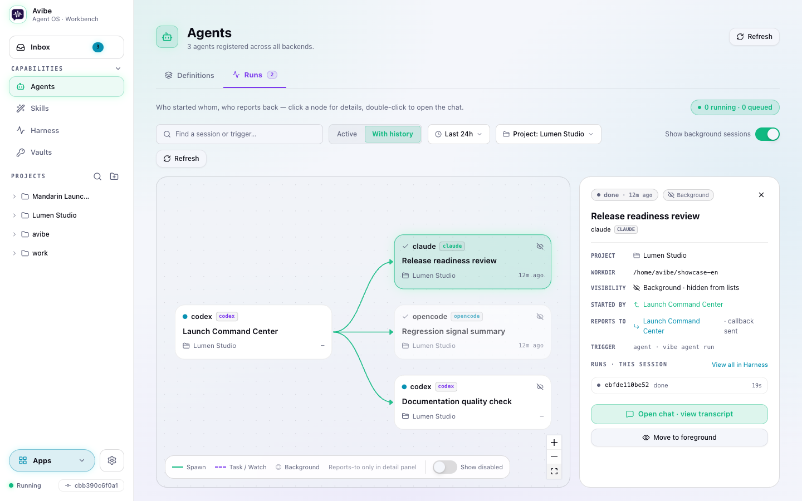
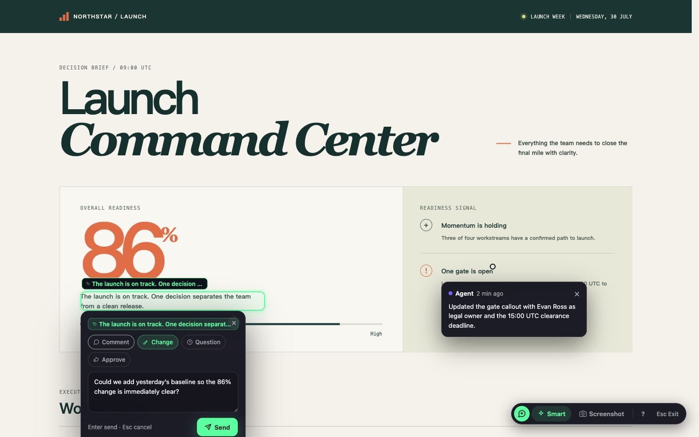
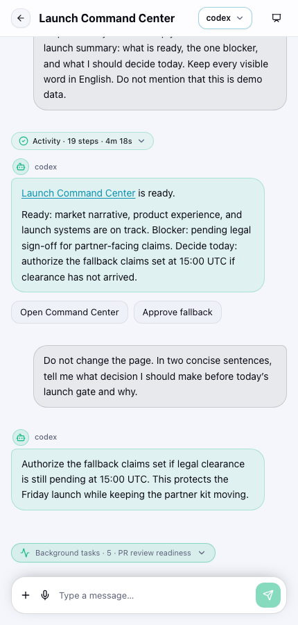

<div align="center">


# Avibe

### The local-first Agent OS — your own AI partner.

**Every agent. Every subscription. Running on your machine, steered from your pocket.**

[](https://github.com/avibe-bot/avibe/stargazers)
[](https://github.com/avibe-bot/avibe/releases/latest)
[](https://www.python.org/)
[](LICENSE)

[Docs](https://docs.avibe.bot) · [English](README.md) · [中文](README_ZH.md)

**Drives**   

**Reach it from**      

</div>

<br/>



---

## Your agent is a genius — chained to a terminal

Claude Code, Codex, and OpenCode are absurdly capable. But:

- 🖥️ **Close the lid, lose the agent.** It lives in one terminal window. Walk away and the work stops with you.
- 📵 **Out of sight, out of control.** Away from your desk, you can't see what it's doing — let alone steer it.
- 💸 **Paying for several plans, stuck on one.** One hits its cap mid-task while another sits idle, and you have no idea which one is earning its keep.
- 🔒 **Every tool wants to own you.** Its app, its cloud, its subscription — and your code on someone else's box.

## Avibe sets it free

**One command, and your machine becomes the home your AI partner lives in.** Drive the *official* Claude Code, Codex, and OpenCode from a browser, your phone, or the chat app you already have open. Your Claude, ChatGPT, Gemini, Kimi, and xAI subscriptions and your API keys all land behind one local gateway. Your code, keys, and agent processes stay on your machine — `avibe.bot` signs you in and opens a secure tunnel, and never touches your workspace.

```bash
bash -o pipefail -c 'curl -fsSL https://avibe.bot/install.sh | bash -s -- --launch'
```

The browser pops open. A three-step wizard wires up your models, finds your agents (one click installs any that are missing), and drops you straight into the Workbench.

> Open source — read the [install script](https://github.com/avibe-bot/avibe/blob/master/install.sh) first if you like. The short URL is a 307 redirect to that file.

<details>
<summary><b>On Windows?</b></summary>

We recommend WSL on Windows for the best compatibility — see [Run Avibe with WSL from scratch](docs/WINDOWS_WSL.md). It covers where to install WSL, which terminal to use, where to run the install command, and how to open the Web UI.
</details>

> 💚 **Built with Avibe.** This project was developed end-to-end using Avibe itself — steering Claude Code, Codex, and OpenCode from the browser and from my phone, picking up seamlessly whether I was at my desk or not. The deeper in I got, the faster it went. — [@alex_metacraft](https://x.com/alex_metacraft)

---

## What you get

### 💬 Not a chat box. A whole Workbench.

Files, editor, and terminal open as windows beside your chat, all in one browser tab — with the apps and Show Pages your agent builds opening right next to them. It stops feeling like a web page and starts feeling like an operating system.



### 🔀 Model Hub — every plan you pay for, finally on the same team

Sign in each subscription and add each API key once — official vendors, relays, aggregators, self-hosted endpoints, all welcome. Switch an agent to gateway mode and Avibe's local gateway routes its models through them in the order you set.

- **Set up once, use it in every agent.** One gateway-held sign-in or key feeds Claude Code, Codex, and OpenCode at the same time — no copying credentials into three configs. (A subscription you leave to its own CLI serves only that CLI.)
- **Mix and match models.** GPT inside Claude Code, Claude inside Codex — put any gateway-held source's models on any agent's list, and the gateway translates between protocols.
- **Plan runs dry? The next one picks it up.** If a source hits a quota, rate limit, or network failure before it starts answering, the next source in your route takes the request — no retry, no babysitting. Once your first choice recovers, the next turn goes back to it.
- **Route it your way.** Give each agent a default source order, then pin any single model to its own route chain.
- **Move in with one click.** Already signed in to a supported CLI? Bring that login over with your explicit OK. Credentials and routes stay on your machine.

*Four sources feeding three agents: GPT and Claude models mixed in every agent, and relay-gpt already covering for Codex's unavailable subscription.*



**Know exactly what your plans are worth.** Usage trends by model and source, and your usage priced at official API rates. For Claude and ChatGPT subscriptions, add live 5-hour and weekly quotas — down to how many times over each plan has already paid for itself.

*One real day on the maintainer's machine: ~680M tokens, worth ~$540 at official API prices.*



### ⏰ It works while you sleep — the Agent Harness

Most AI tools freeze the moment you stop typing. Avibe gives your agent four durable primitives — **run, schedule, watch, and inspect** — so it starts work on its own, waits for the right moment, grinds away in the background, and comes back when there's something worth your attention. Scheduled shell commands stay silent when they pass; a failure leaves a notice — or, if you opt in, goes straight to an Agent.

No flags to learn. Just say it:

- *"Watch this PR and come back when there's actionable review feedback."*
- *"Run the deployment check every weekday morning and post the summary here."*
- *"Start a separate investigation session for this incident, but report the conclusion to this channel."*
- *"If CI fails, summarize the logs; if it passes, tell me whether the PR is mergeable."*



### 🤖 The real agents, not knock-offs

Avibe runs the official Claude Code, Codex, and OpenCode CLIs — the same ones you'd install yourself — behind one Agent registry. Give each Agent its own model and reasoning effort, and hand each project or channel to the right specialist. Write a Skill once; all three backends load it the same way.

When your agents start delegating to each other, **Runs** draws the whole chain as a graph: who started each background Session, where it reports back, and the history behind every node.



### 🎨 Show Pages — your agent answers with a web page

Ask for a dashboard, flowchart, diff, report, or small app, and get a live page instead of a wall of text. Click an element, box a region, or mark up a screenshot with numbered notes, say what you want, and the agent reworks the page or answers right where you pointed.

Keep a page private, or pair with `avibe.bot` to share it with specific people or publish it at a link you'll actually remember. Pin your favorites to the Dock and they open like apps.



### 📱 Leave your desk. Keep your agent.



Your machine does the work; you don't have to babysit it. Open the Workbench when you want windows, or fire off a message in Slack, Discord, Telegram, WeChat, or Lark / Feishu when that's faster — same Agents, same machine.

- 🔔 **It taps you on the shoulder.** Install the Workbench on your phone or desktop and get a push the moment a job needs you.
- 🎙️ **Talk, don't type.** Pair with `avibe.bot` and realtime voice input writes as you speak, then tidies the transcript in place. On desktop, press ⌥Z (Alt+Z on Windows and Linux).
- 🌍 **Your own `you-app.avibe.bot`.** Pair once with `vibe remote` and your Workbench opens in any browser, anywhere — no VPN, no port forwarding.
- 🔒 **Your door, your guest list.** Only the people your access policy allows can sign in — by default, just you. Auth, routing, and host checks all fail closed.

On a plane. At a café. On a borrowed laptop. Your agent pings you; you open the link, steer, and walk away again.

<br clear="all"/>

### 🔐 Vaults — secrets by name, never by value

Add an API key or token once — or let an Agent request a missing one for you to fill in from the browser. Agents use it by name, and Avibe hands it to the command, authenticated request, or signing operation that needs it. Vault responses never include the secret value; commands receiving it must still avoid printing it. Passkey-protected custody stays pre-launch until the sandbox integrity gate is enforced.

**Plus** — thread = session, picks up where you left off · interactive buttons and forms when the agent needs a decision · rich attachments with in-app preview and inline audio · keyboard shortcuts · one-click backend updates.

---

## Why Avibe is different

| | |
|---|---|
| **Local-first, actually yours** | Your AI partner, its execution, your keys, and your code stay on your machine. `avibe.bot` issues identity and a secure tunnel; it never proxies your workspace. |
| **Every first-party agent, one home** | Drive the *official* Claude Code, Codex, and OpenCode. Switch per task, per project, or per channel — no vendor silo. |
| **Every subscription, one team** | Model Hub pools your plans and keys behind one gateway, lets agents mix models, fails over on its own, and shows what each one is really worth. |
| **Browser and chat, both first-class** | Workbench, phone, Slack, Discord, Telegram, WeChat, and Lark / Feishu — same agents, same machine. |
| **No middleman tax** | No extra reasoning loop sits between you and your agent. Every token goes straight to the agent you chose. |

---

## How it works

```
  You, anywhere              Your machine                            Your models
┌──────────────┐      ┌──────────────────────────────────────┐      ┌──────────────┐
│ Browser      │      │ Avibe                                │      │ Subscriptions│
│ Phone (PWA)  │ ───▶ │   Claude Code ─┐                     │      │ API keys     │
│ Slack        │      │   Codex       ─┼─▶ Model Hub ────────┼────▶ │ Relays       │
│ Discord …    │ ◀─── │   OpenCode    ─┘                     │      │ Self-hosted  │
└──────────────┘      └──────────────────────────────────────┘      └──────────────┘
```

1. **You ask** — in the browser or a chat app: *"Add dark mode to the settings page."*
2. **Avibe routes** the message to the right Agent, in the right project.
3. **The agent** reads your local codebase, writes code, and streams its work back. In gateway mode, Model Hub picks the source for each call; in direct mode, the agent uses its own login.
4. **You review** in the same surface, iterate in the thread, and pick it up later from anywhere.

Avibe connects out via Slack Socket Mode, Discord Gateway, Telegram long-polling, WeChat polling, or Lark WebSocket — no public inbound ports for chat control. Agent prompts go only to the model sources you configure.

---

## Avibe vs OpenClaw

| | Avibe | OpenClaw |
|---|---|---|
| **Setup** | One command + web wizard. Done in minutes. | Gateway + channels + JSON config. Expect an afternoon. |
| **Security** | Local-first. Outbound Socket Mode / WebSocket / long polling only. No public inbound ports, minimal attack surface. | Gateway exposes ports. More moving parts, more surface. |
| **Token cost** | No extra reasoning loop in between. Tokens go straight to your chosen agent. | Every message carries a long persona/orchestration context. Tokens burn on overhead before your task starts. |
| **Lock-in** | Drives the official agent CLIs; bring your own subscriptions and keys; switch per task. | Tied to its own assistant loop. |

OpenClaw is an always-on personal assistant. Avibe is the **Agent OS** for the agents you already trust: the agent stays itself, your data stays local, and the colleague experience comes from putting the agent where your work already happens.

---

## FAQ

<details>
<summary><b>Can I use my existing Claude or ChatGPT subscription?</b></summary>

Yes. Claude Code and Codex can keep their own logins, or you can add supported subscriptions to Model Hub as gateway sources to get quota tracking, usage analytics, and automatic takeover. Each vendor's terms still apply; Avibe warns you before a sign-in that may carry account restrictions. See [Model Hub](https://docs.avibe.bot/concepts/model-hub).
</details>

<details>
<summary><b>Does it run local models?</b></summary>

Local-first here means your **code, data, and execution** stay on your machine — not necessarily the model weights. Model Hub can point at any compatible self-hosted endpoint if you want inference local too.
</details>

<details>
<summary><b>Where do my code and data go?</b></summary>

Your code, keys, and agent processes stay on your machine. Agent prompts go to the model sources you configure. `avibe.bot` handles sign-in and the Remote Web UI tunnel without proxying your workspace; Voice input is the exception that goes through `avibe.bot` for transcription. The [boundary inventory](https://docs.avibe.bot/concepts/local-first#what-leaves-your-machine) lists every network path that carries your content.
</details>

<details>
<summary><b>Do I have to pay for Avibe?</b></summary>

Avibe is open source (MIT) and free to run. You bring your own agent subscriptions or API keys and pay your provider directly — no markup, no second subscription.
</details>

<details>
<summary><b>Which agents and platforms are supported?</b></summary>

**Agents:** the official Claude Code, Codex, and OpenCode CLIs. **Surfaces:** a built-in browser Workbench (installable on desktop and mobile) plus Slack, Discord, Telegram, WeChat, and Lark / Feishu.
</details>

<details>
<summary><b>Is remote access secure?</b></summary>

`vibe remote` runs a Cloudflare tunnel from your machine; browser traffic reaches it only after sign-in (except Show Pages you choose to publish), and only for the people your access policy allows (by default, just you). Auth, routing, and host checks are **fail-closed**, and there are no public inbound ports for chat control.
</details>

<details>
<summary><b>How is Avibe different from OpenClaw or Hermes?</b></summary>

OpenClaw and Hermes are *agents* — a gateway-style assistant and a self-improving agent. Avibe is a different layer: the **Agent OS**. It gives every agent it runs a unified world model — agents, sessions, Show Pages, the Harness, Model Hub — so it can schedule itself, build its own loops, and reach you through a real interaction layer, then runs the official Claude Code, Codex, and OpenCode you bring (an Avibe-native agent is [on the roadmap](#roadmap)). See the [comparison table](#avibe-vs-openclaw) above for OpenClaw specifics.
</details>

---

## Meet Vibey

<div align="center">

</div>

Lives in your Workbench and your chat apps. Reads the room. Picks up where you left off. Asks the right question when it's unsure. Goes quiet when you're heads-down. Ships at 2am because that's when the vibe hits — then leaves a note about what it touched.

> Avibe is the home your agent lives in. Vibey is the colleague who lives there.

Forgets nothing. Holds opinions. Says thanks when you fix its bugs.

---

## Commands

```bash
vibe            # Start Avibe and open the Workbench
vibe status     # Check service and configuration status
vibe stop       # Stop the local service
vibe upgrade    # Upgrade to the latest release
vibe doctor     # Diagnose common setup issues; "vibe doctor repair" applies safe fixes
vibe remote     # Reach your Workbench from any device via avibe.bot
vibe agent      # Run and manage Avibe Agents
vibe task       # Schedule time-based work (cron / one-off)
vibe watch      # Wait on a condition, then act
vibe runs       # Inspect agent run history
vibe show       # Create, inspect, and publish Show Pages
vibe vault      # Manage secrets, requests, authenticated fetches, and signing
```

| In chat | What it does |
|---|---|
| Mention the bot | Start a task or ask a question |
| Reply in thread | Continue the same agent session |
| `/stop` | Interrupt the current run |

Full references: [Commands](docs/COMMANDS.md) · [CLI](docs/CLI.md)

---

## Agents

The setup wizard detects Claude Code, Codex, and OpenCode on your machine and installs any you choose that are missing. To install one yourself:

<details>
<summary><b>Claude Code</b></summary>

```bash
bash -o pipefail -c 'curl -fsSL https://claude.ai/install.sh | bash'
```
</details>

<details>
<summary><b>Codex</b></summary>

```bash
npm install -g @openai/codex
```
</details>

<details>
<summary><b>OpenCode</b></summary>

```bash
bash -o pipefail -c 'curl -fsSL https://opencode.ai/install | bash'
```

OpenCode may pause tool calls for approval unless `~/.config/opencode/opencode.json` allows them; the setup wizard can set this for you:

```json
{ "permission": "allow" }
```
</details>

---

## Security

- **Local-first** — Avibe runs on your machine; your code and agent processes stay there.
- **No public inbound ports** — Socket Mode / WebSocket / long-polling only for chat control.
- **Your keys, your data** — stored under `~/.avibe/`; agent prompts go only to the model sources you configure. Existing installs keep `~/.vibe_remote/` as a compatibility path.
- **Fail-closed remote access** — `avibe.bot` brokers identity and the tunnel, never your workspace.

---

## Uninstall

The snippet removes the first `vibe` on your `PATH`. If `which -a vibe` lists more than one Avibe launcher, remove the others too.

```bash
avibe_home="${AVIBE_HOME:-$HOME/.avibe}"
avibe_home="${avibe_home/#\~/$HOME}"
vibe_bin="$(command -v vibe)"   # capture Avibe's launcher before uninstalling
if "$vibe_bin" version 2>/dev/null | grep -Eq '^(avibe-os|vibe-remote) '; then
  "$vibe_bin" stop
else
  echo "Skipping ${vibe_bin}: not Avibe's launcher"; vibe_bin=""
fi
uv tool uninstall avibe-os
uv tool uninstall vibe-remote   # legacy install
[ -n "$vibe_bin" ] && rm -f "$vibe_bin" "$(dirname "$vibe_bin")/.vibe.avibe-generation"
rm -rf "$avibe_home/runtime/install-generations"
rm -rf "$avibe_home" ~/.vibe_remote
```

---

## Roadmap

What's coming next:

- **A native desktop app** — macOS and Windows builds with signed self-updates are in testing now.
- **Deeper interaction-first workflows** — more direct manipulation, structured decisions, and in-place collaboration between chat, apps, and Show Pages.
- **Protected Vault custody** — finish the immutable sandbox integrity gate before enabling passkey-protected secrets for real users.
- **SaaS mode** — one-click hosted onboarding with a cloud relay, while execution still stays on your own machine.
- **An Avibe-native agent** — a first-party agent tuned for this runtime, alongside the official CLIs you bring.

Shipped recently: Model Hub with automatic takeover, quota tracking, and usage analytics · realtime voice input · Show Page sharing · Skills unified across all three backends · the three-step setup wizard · the Agent Harness and run graph · multi-window Apps · Standard Vaults.

---

## Docs

- **[Official Docs](https://docs.avibe.bot)** — quickstart, concepts, platform & agent guides, troubleshooting
- **[What is Avibe](https://docs.avibe.bot/concepts/agent-os)** — the Agent OS model
- **[Model Hub](https://docs.avibe.bot/concepts/model-hub)** — sources, routes, takeover, usage, and quota
- **[CLI Reference](docs/CLI.md)** · **[Commands](docs/COMMANDS.md)** · **[Show Pages](docs/SHOW_PAGES.md)**
- **[Install via AI agent](docs/INSTALL_FOR_AI.md)** — hand this to Claude Code, Codex, or OpenCode for guided setup
- **[Slack](docs/SLACK_SETUP.md)** · **[Discord](docs/DISCORD_SETUP.md)** · **[Telegram](docs/TELEGRAM_SETUP.md)** setup guides

---

<div align="center">

**Own your agents. Take them everywhere.**

[Install Now](#avibe-sets-it-free) · [Docs](https://docs.avibe.bot) · [Report a bug](https://github.com/avibe-bot/avibe/issues) · [Follow @alex_metacraft](https://x.com/alex_metacraft)

</div>
