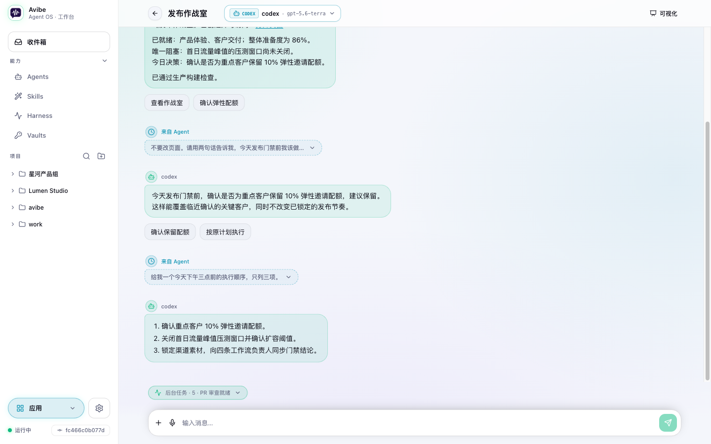
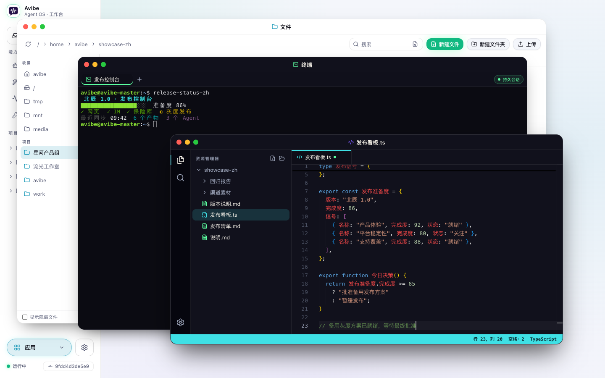
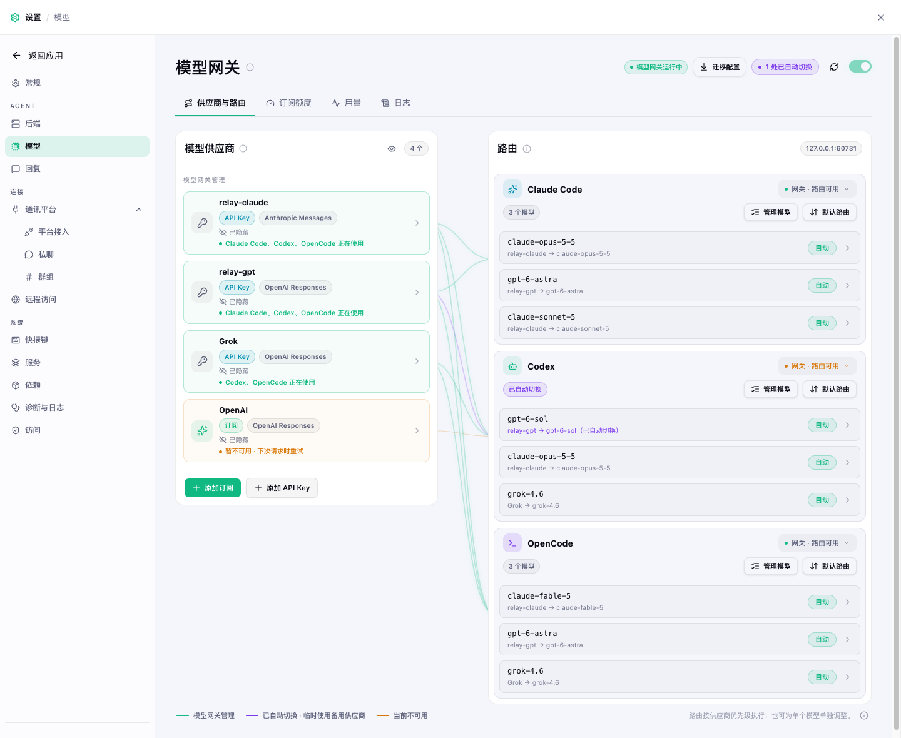
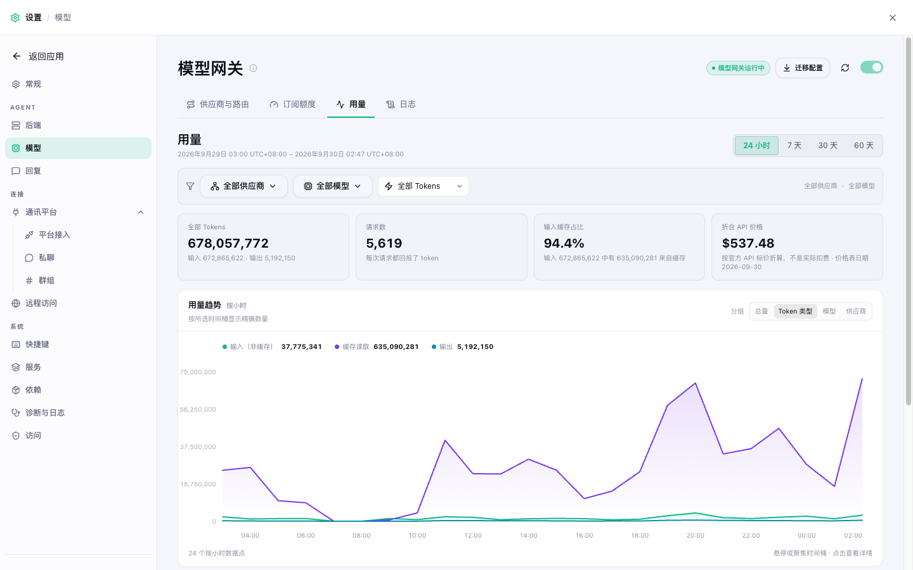
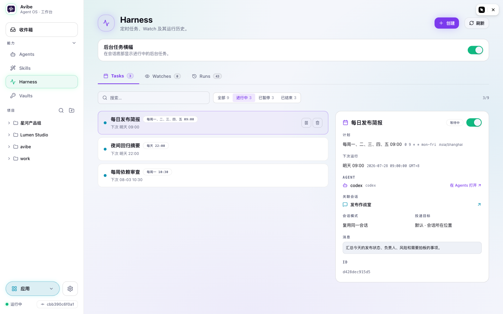
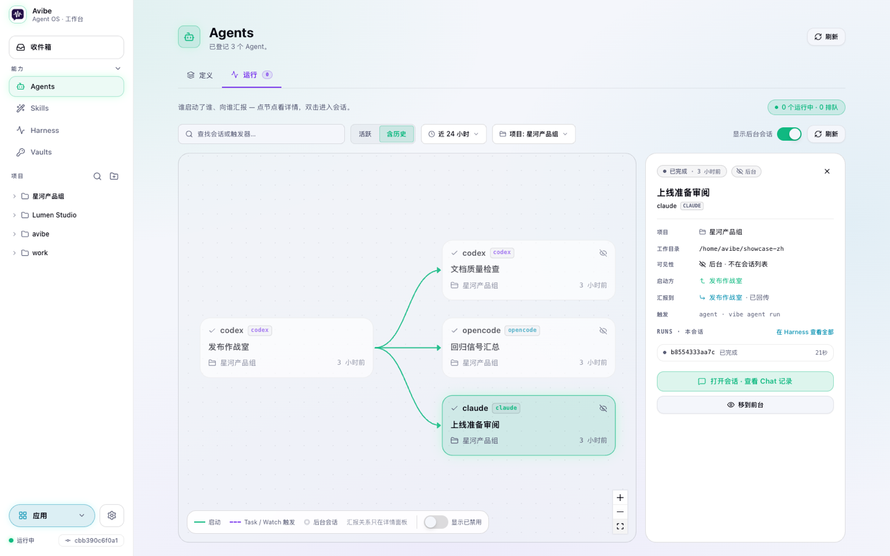
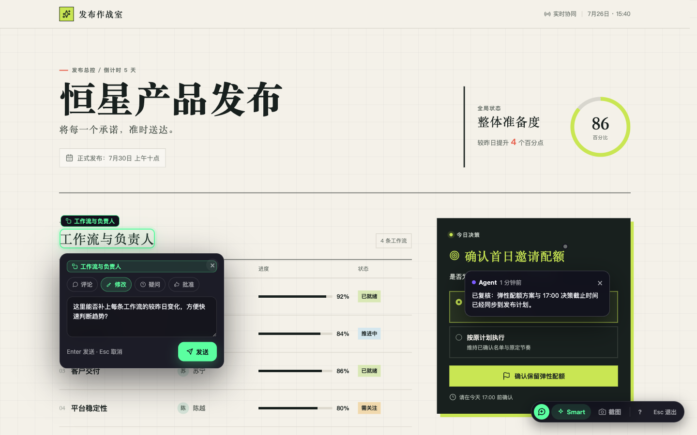
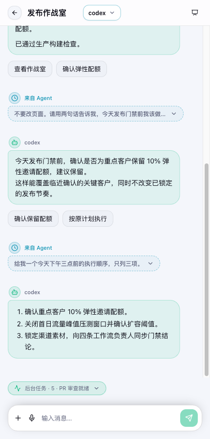

<div align="center">


# Avibe

### Avibe 是本地优先的 Agent OS——你的专属 AI 伙伴。

**所有 Agent，所有订阅，随时随地调用，始终跑在你自己的机器上。**

[](https://github.com/avibe-bot/avibe/stargazers)
[](https://github.com/avibe-bot/avibe/releases/latest)
[](https://www.python.org/)
[](LICENSE)

[文档](https://docs.avibe.bot/zh) · [English](README.md) · [中文](README_ZH.md)

**驱动**   

**从这些地方找到它**      

</div>

<br/>



---

## 你的 Agent 是个天才——却被拴在终端里

Claude Code、Codex、OpenCode 都强得离谱。可是：

- 🖥️ **合上盖子，它就歇了。** 它活在一个终端窗口里，你一走开，活儿也跟着停。
- 📵 **离开工位，就失联。** 它在干什么你看不到，更别提指挥它。
- 💸 **付着好几份订阅，却卡在一份额度上。** 一个套餐干到一半撞墙，另一个在吃灰；哪个真值回票价，你根本说不清。
- 🔒 **每个工具都想把你圈起来。** 它的 app、它的云、它的订阅——还有你那份跑到别人服务器上的代码。

## Avibe 给它松绑

**一条命令，你的机器就成了 AI 伙伴的家。** 用浏览器、手机，或者你本来就开着的聊天软件，驱动*官方*的 Claude Code、Codex、OpenCode。你的 Claude、ChatGPT、Gemini、Kimi、xAI 订阅，加上各家 API Key，统统汇进同一个本地网关。代码、密钥和 agent 进程都留在你的机器上——`avibe.bot` 负责登录和安全隧道，从不碰你的工作区。

```bash
bash -o pipefail -c 'curl -fsSL https://avibe.bot/install.sh | bash -s -- --launch'
```

浏览器自动弹开，三步设置向导帮你接好模型、找到你已有的 agent（缺的点一下就装上），直接把你送进 Workbench。

> 开源——想看可以先读一遍[安装脚本](https://github.com/avibe-bot/avibe/blob/master/install.sh)。短链只是到这个文件的 307 重定向。

<details>
<summary><b>用 Windows？</b></summary>

Windows 上推荐用 WSL，兼容性最好——见 [从零用 WSL 跑 Avibe](docs/WINDOWS_WSL_ZH.md)。里面讲清楚 WSL 装在哪、用哪个终端、在哪运行安装命令、怎么打开 Web UI。
</details>

> 💚 **Avibe 是用 Avibe 自己做出来的。** 这个项目从头到尾都是我用 Avibe 开发的——从浏览器、从手机指挥 Claude Code、Codex、OpenCode，在不在电脑前都能无缝衔接。越往后做越快，体验和效率直接拉爆。—— [@alex_metacraft](https://x.com/alex_metacraft)

---

## 你能得到什么

### 💬 不是又一个聊天框，是一整个 Workbench

文件、编辑器、终端开成窗口，和对话并排摆在同一个浏览器标签页里；agent 做出来的应用和 Show Page 就开在旁边。用着用着你会忘了这是网页——它更像一个操作系统。



### 🔀 Model Hub——你付费的每一份订阅，终于能组队干活

订阅登录一次、API Key 添加一次——官方厂商、中转站、聚合平台、自建服务，来者不拒。把 Agent 切到网关模式，Avibe 的本地网关就按你排好的顺序，把它的模型请求送过去。

- **配一次，所有 Agent 都能用。** 交给模型网关管理的一次登录、一个 Key，Claude Code、Codex、OpenCode 同时取用——不用把凭据抄进三份配置。（留给 CLI 自己管理的订阅，只供那个 CLI 用。）
- **模型随便混搭。** 在 Claude Code 里用 GPT，在 Codex 里用 Claude——只要来源交给模型网关管理，它的模型就能加进任何 agent 的列表，协议差异由网关负责转换。
- **额度见底？下一个已经接上了。** 某个来源在开始回答前撞上额度、限流或网络故障，路由里的下一个来源直接接手这次请求——你不用重试，也不用盯着。首选来源恢复后，下一轮对话自动切回去。
- **路由想怎么排就怎么排。** 每个 agent 一套默认的来源顺序，任何一个模型还能单独固定自己的路由。
- **一键搬家。** 已经在支持的 CLI 里登录过？你点头，登录就迁过来。凭据和路由都留在你的机器上。

*四个来源供给三个 agent：每个 agent 都混用 GPT 和 Claude 模型，Codex 的订阅暂不可用，relay-gpt 已经顶上。*



**每份套餐值多少，一清二楚。** 按模型和来源看用量趋势，按官方 API 价格把用量折成钱。Claude 和 ChatGPT 订阅还能实时盯住 5 小时和每周额度——直接算出每个套餐已经回本几倍。

*维护者机器上真实的一天：24 小时约 6.8 亿 token，按官方 API 价格折合约 $540。*



### ⏰ 你睡觉，它上班——Agent Harness

大多数 AI 工具，你一停手它就停。Avibe 给 agent 四个持久化基础能力——**运行、定时、监听、查历史**——让它能自己开工、等准时机、在后台闷头干完，有值得你看的东西再回来找你。定时 shell 命令成功时一声不吭，失败时留下一条通知——你开启的话，也能直接交给 Agent 处理。

不用背参数，直接说：

- *"盯着这个 PR，有可执行的 review 意见了再回来找我。"*
- *"每个工作日早上跑一次部署检查，把总结发到这里。"*
- *"为这个故障单独开个调查会话，结论汇报回这个频道。"*
- *"CI 挂了就总结日志；过了就告诉我这个 PR 能不能合。"*



### 🤖 正版 Agent，不是山寨复刻

Avibe 运行的是官方 Claude Code、Codex、OpenCode CLI——就是你自己会装的那几个——统一收进一套 Agent 注册表。每个 Agent 单独选模型和推理强度，每个项目、每个频道都交给最合适的专家。Skill 写一次，三个后端用同一种方式加载。

agent 之间开始互相派活时，**Runs** 把整条协作链画成一张图：谁发起了哪个后台会话、结果汇报给谁、每个节点背后的执行历史。



### 🎨 Show Pages——agent 直接甩给你一个网页

要仪表盘、流程图、diff、报告，还是一个小应用？agent 交给你的是一个活的网页，而不是一大段文字。点一个元素、框一块区域、在截图上标几条编号批注，说一句你想要什么，agent 就改页面，或者就在你指的地方回答。

页面可以私有；和 `avibe.bot` 配对后，还能只分享给指定的人，或者发布成一个好记的链接。常用的固定到应用栏，点开就是一个 app。



### 📱 人离开工位，agent 照样在手



活儿在你的机器上跑，你不用守着它。想开窗口就用 Workbench；想快就在 Slack、Discord、Telegram、微信或飞书里发一条消息——连到的是同一批 Agent、同一台机器。

- 🔔 **需要你时，它会拍拍你。** 把 Workbench 装成手机或桌面 app，任务需要你的那一刻就收到推送。
- 🎙️ **动嘴，不动手。** 和 `avibe.bot` 配对后，实时语音输入边说边出字，说完自动就地整理干净。桌面上按 ⌥Z（Windows 和 Linux 上是 Alt+Z）。
- 🌍 **你专属的 `you-app.avibe.bot`。** `vibe remote` 配对一次，你的 Workbench 在任何地方、任何浏览器里都能打开——不用 VPN，不用端口转发。
- 🔒 **你的门，你定名单。** 只有你的访问策略允许的人能登录——默认只有你自己。认证、路由、主机校验全部默认拒绝。

在飞机上，在咖啡馆，用着借来的电脑。agent 叫你一声，你打开链接指挥两句，转身接着忙。

<br clear="all"/>

### 🔐 Vaults——按名字用密钥，永远不碰密钥值

API Key 或 token 添加一次——缺了哪个，Agent 也能发请求让你在浏览器里补上。Agent 按名字取用，Avibe 把它递给需要它的命令、认证请求或签名操作。Vault 的响应永远不包含密钥值；接收密钥的命令仍需避免把它打印出来。passkey 保护托管在 sandbox 完整性门禁落地前仍未上线。

**还有**——thread 即会话，随时接着聊 · agent 需要你拍板时弹按钮和表单 · 丰富的附件，应用内直接预览，音频就地播放 · 键盘快捷键 · 后端一键升级。

---

## Avibe 凭什么不同

| | |
|---|---|
| **本地优先，真正归你** | AI 伙伴、它的执行、你的密钥和代码都留在你的机器上。`avibe.bot` 签发身份、提供安全隧道，从不代理你的工作区。 |
| **所有第一方 agent，一个家** | 驱动*官方*的 Claude Code、Codex、OpenCode。按任务、按项目、按频道切换，不被任何一家锁死。 |
| **所有订阅，组成一支队** | Model Hub 把你的套餐和 Key 汇进同一个网关，模型可以跨 agent 混搭，自动故障接管，还告诉你每一份到底值多少。 |
| **浏览器和聊天，都是一等公民** | Workbench、手机、Slack、Discord、Telegram、微信、飞书——同一批 agent，同一台机器。 |
| **没有中间商抽成** | 你和 agent 之间没有额外的推理循环，每个 token 都直接给到你选的 agent。 |

---

## 它怎么工作

```
  你，在任何地方             你的机器                                你的模型
┌──────────────┐      ┌──────────────────────────────────────┐      ┌──────────────┐
│ Browser      │      │ Avibe                                │      │ Subscriptions│
│ Phone (PWA)  │ ───▶ │   Claude Code ─┐                     │      │ API keys     │
│ Slack        │      │   Codex       ─┼─▶ Model Hub ────────┼────▶ │ Relays       │
│ Discord …    │ ◀─── │   OpenCode    ─┘                     │      │ Self-hosted  │
└──────────────┘      └──────────────────────────────────────┘      └──────────────┘
```

1. **你开口**——在浏览器或聊天软件里：*"给设置页加个深色模式。"*
2. **Avibe 路由**到对的 Agent、对的项目。
3. **agent** 读你本地的代码、写代码、把过程流式回传。网关模式下，每次调用走哪个来源由 Model Hub 决定；直连模式下，agent 用它自己的登录。
4. **你在同一个界面里 review**，在 thread 里迭代，之后在任何地方接着干。

Avibe 通过 Slack Socket Mode、Discord Gateway、Telegram 长轮询、微信轮询或飞书 WebSocket 主动向外连接——聊天控制不需要任何公网入站端口。agent 的 prompt 只发给你配置的模型来源。

---

## Avibe vs OpenClaw

| | Avibe | OpenClaw |
|---|---|---|
| **上手** | 一条命令 + 网页向导，几分钟搞定。 | Gateway + channels + JSON 配置，准备花一个下午。 |
| **安全** | 本地优先，只用 Socket Mode / WebSocket / 长轮询主动外连，无公网入站端口，攻击面极小。 | Gateway 要暴露端口，组件更多，面更大。 |
| **Token 成本** | 中间没有额外的推理循环，token 直接给到你选的 agent。 | 每条消息都带着长长的人设/编排上下文，任务还没开始 token 就先烧在开销上。 |
| **锁定** | 驱动官方 agent CLI，自带订阅和 Key，按任务切换。 | 绑死在它自己的助手循环里。 |

OpenClaw 是一个常驻的个人助手。Avibe 是给你已经信任的 agent 用的 **Agent OS**：agent 还是它自己，数据留在本地，而"同事感"来自把 agent 放进你本来就在工作的地方。

---

## 常见问题

<details>
<summary><b>能用我现有的 Claude 或 ChatGPT 订阅吗？</b></summary>

能。Claude Code 和 Codex 可以继续用各自的登录；也可以把支持的订阅作为网关来源加进 Model Hub，获得额度追踪、用量分析和自动接管。各厂商的条款依然适用；如果某种登录方式可能带来账号限制，Avibe 会在登录前提醒你。详见 [Model Hub](https://docs.avibe.bot/zh/concepts/model-hub)。
</details>

<details>
<summary><b>能跑本地模型吗？</b></summary>

这里的"本地优先"指你的**代码、数据和执行**留在你的机器上——不一定是模型权重。如果你也想让推理在本地，Model Hub 可以指向任何兼容的自建服务。
</details>

<details>
<summary><b>我的代码和数据会去哪？</b></summary>

代码、密钥和 agent 进程都留在你的机器上。agent 的 prompt 发给你配置的模型来源。`avibe.bot` 负责登录和远程 Web UI 隧道，但不代理你的工作区；例外是语音输入，它会经 `avibe.bot` 做转写。每一条承载你内容的网络路径都列在[边界清单](https://docs.avibe.bot/zh/concepts/local-first#哪些东西会离开你的机器)里。
</details>

<details>
<summary><b>Avibe 要付费吗？</b></summary>

Avibe 开源（MIT），免费运行。你自带 agent 订阅或 API Key，直接付给服务商——不加价，也不用再多订一份。
</details>

<details>
<summary><b>支持哪些 agent 和平台？</b></summary>

**Agent：** 官方 Claude Code、Codex、OpenCode CLI。**界面：** 内置浏览器 Workbench（可安装到桌面和手机），以及 Slack、Discord、Telegram、微信、飞书。
</details>

<details>
<summary><b>远程访问安全吗？</b></summary>

`vibe remote` 从你的机器上跑一条 Cloudflare 隧道；浏览器流量必须先登录（你主动公开发布的 Show Page 除外），而且只放行你的访问策略允许的人（默认只有你）。认证、路由、主机校验全部 **fail-closed**，聊天控制也不需要任何公网入站端口。
</details>

<details>
<summary><b>Avibe 和 OpenClaw、Hermes 有什么不同？</b></summary>

OpenClaw 和 Hermes 是 *agent*——一个是网关式助手，一个是会自我进化的 agent。Avibe 在另一层：**Agent OS**。它给自己运行的每个 agent 一个统一的世界模型——Agent、会话、Show Page、Harness、Model Hub——让 agent 能自己排期、搭自己的循环、通过真正的交互层找到你；然后它运行的是你自带的官方 Claude Code、Codex、OpenCode（Avibe 原生 agent [在路线图上](#路线图)）。OpenClaw 的具体对比见上面的[对比表](#avibe-vs-openclaw)。
</details>

---

## 认识云团子（Vibey）

<div align="center">

</div>

住在你的 Workbench 和聊天软件里。读得懂气氛，会接你昨天没做完的活儿。不确定就先问一句，你专注的时候它不打扰，凌晨两点灵感来了就动手，第二天给你留张便条，说改了哪儿。

> Avibe 是 agent 住的那个家，云团子是住在里面的那位同事。

什么都记得，有自己的脾气。你修了它的 bug，它会道谢。

---

## 命令

```bash
vibe            # 启动 Avibe 并打开 Workbench
vibe status     # 查看服务和配置状态
vibe stop       # 停止本地服务
vibe upgrade    # 升级到最新版本
vibe doctor     # 诊断常见安装问题；"vibe doctor repair" 执行安全修复
vibe remote     # 通过 avibe.bot 从任意设备访问 Workbench
vibe agent      # 运行和管理 Avibe agent
vibe task       # 安排定时工作（cron / 一次性）
vibe watch      # 等一个条件成立，然后行动
vibe runs       # 查看 agent 运行历史
vibe show       # 创建、查看和发布 Show Page
vibe vault      # 管理密钥、请求、认证请求与签名
```

| 在聊天里 | 作用 |
|---|---|
| @ 一下 bot | 开一个任务或提问 |
| 在 thread 里回复 | 继续同一个 agent 会话 |
| `/stop` | 中断当前执行 |

完整参考：[命令](docs/COMMANDS_ZH.md) · [CLI](docs/CLI_ZH.md)

---

## Agent

设置向导会检测你机器上的 Claude Code、Codex 和 OpenCode，缺哪个、你选了哪个，就帮你装上。想自己装的话：

<details>
<summary><b>Claude Code</b></summary>

```bash
bash -o pipefail -c 'curl -fsSL https://claude.ai/install.sh | bash'
```
</details>

<details>
<summary><b>Codex</b></summary>

```bash
npm install -g @openai/codex
```
</details>

<details>
<summary><b>OpenCode</b></summary>

```bash
bash -o pipefail -c 'curl -fsSL https://opencode.ai/install | bash'
```

除非 `~/.config/opencode/opencode.json` 放行工具调用，否则 OpenCode 可能会停下来等你审批；设置向导可以帮你写好：

```json
{ "permission": "allow" }
```
</details>

---

## 安全

- **本地优先**——Avibe 跑在你的机器上，代码和 agent 进程都留在那。
- **无公网入站端口**——聊天控制只用 Socket Mode / WebSocket / 长轮询。
- **你的密钥，你的数据**——存放在 `~/.avibe/`；agent 的 prompt 只发给你配置的模型来源。已有安装会保留 `~/.vibe_remote/` 作为兼容路径。
- **远程访问默认拒绝**——`avibe.bot` 负责身份和隧道，从不经手你的工作区。

---

## 卸载

这段命令只删除 `PATH` 上排在最前面的 `vibe`。如果 `which -a vibe` 列出了不止一个 Avibe 启动器，其余的也要一并删掉。

```bash
avibe_home="${AVIBE_HOME:-$HOME/.avibe}"
avibe_home="${avibe_home/#\~/$HOME}"
vibe_bin="$(command -v vibe)"   # 卸载前先记下 Avibe 的启动器
if "$vibe_bin" version 2>/dev/null | grep -Eq '^(avibe-os|vibe-remote) '; then
  "$vibe_bin" stop
else
  echo "跳过 ${vibe_bin}：不是 Avibe 的启动器"; vibe_bin=""
fi
uv tool uninstall avibe-os
uv tool uninstall vibe-remote   # 旧版安装
[ -n "$vibe_bin" ] && rm -f "$vibe_bin" "$(dirname "$vibe_bin")/.vibe.avibe-generation"
rm -rf "$avibe_home/runtime/install-generations"
rm -rf "$avibe_home" ~/.vibe_remote
```

---

## 路线图

接下来要做的：

- **原生桌面 app**——带签名自动更新的 macOS 和 Windows 版本正在测试中。
- **更深入的交互式工作流**——在 Chat、应用与 Show Page 之间加入更多直接操作、结构化决策和原位协作。
- **保护档 Vault 托管**——完成不可变 sandbox 完整性门禁后，再向真实用户开放 passkey 保护的密钥。
- **SaaS 模式**——一键托管上手 + 云端中继，而执行依然留在你自己的机器上。
- **Avibe 原生 agent**——为这个运行时调校的第一方 agent，与你自带的官方 CLI 并存。

近期已上线：支持自动接管、额度追踪和用量分析的 Model Hub · 实时语音输入 · Show Page 分享 · 三个后端统一的 Skills · 三步设置向导 · Agent Harness 与运行关系图 · 多窗口应用 · 标准档 Vaults。

---

## 文档

- **[官方文档](https://docs.avibe.bot/zh)**——快速上手、概念、平台与 agent 指南、排障
- **[Avibe 是什么](https://docs.avibe.bot/zh/concepts/agent-os)**——Agent OS 模型
- **[Model Hub](https://docs.avibe.bot/zh/concepts/model-hub)**——来源、路由、自动接管、用量与额度
- **[CLI 参考](docs/CLI_ZH.md)** · **[命令](docs/COMMANDS_ZH.md)** · **[Show Pages](docs/SHOW_PAGES.md)**
- **[让 AI agent 帮你装](docs/INSTALL_FOR_AI_ZH.md)**——把它丢给 Claude Code、Codex 或 OpenCode，引导式安装
- **[Slack](docs/SLACK_SETUP_ZH.md)** · **[Discord](docs/DISCORD_SETUP_ZH.md)** · **[Telegram](docs/TELEGRAM_SETUP_ZH.md)** 设置指南

---

<div align="center">

**Agent 归你。走到哪，带到哪。**

[立即安装](#avibe-给它松绑) · [文档](https://docs.avibe.bot/zh) · [报 bug](https://github.com/avibe-bot/avibe/issues) · [关注 @alex_metacraft](https://x.com/alex_metacraft)

</div>
